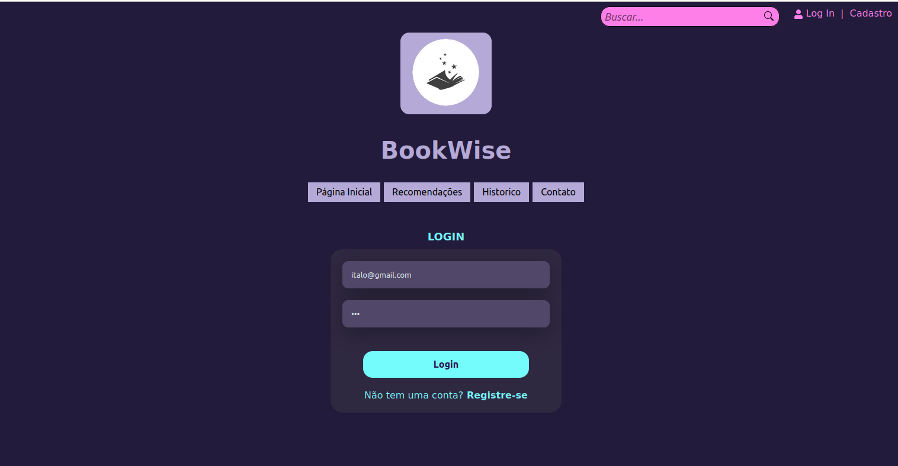
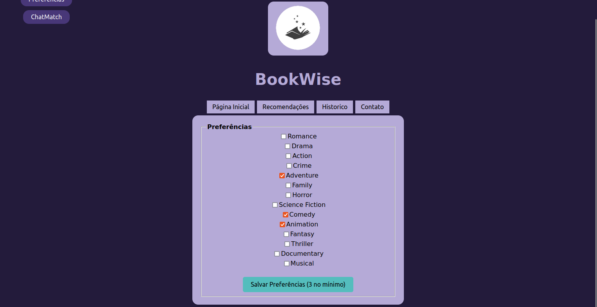
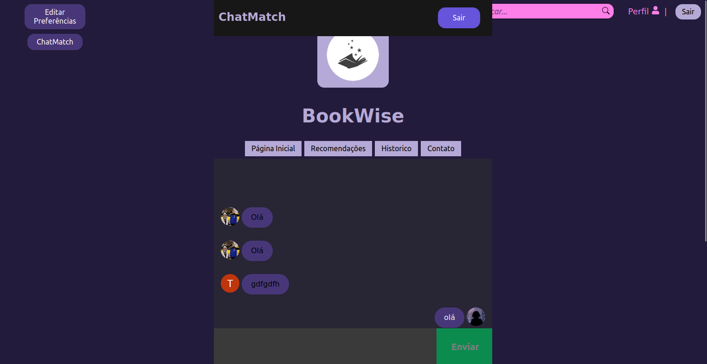
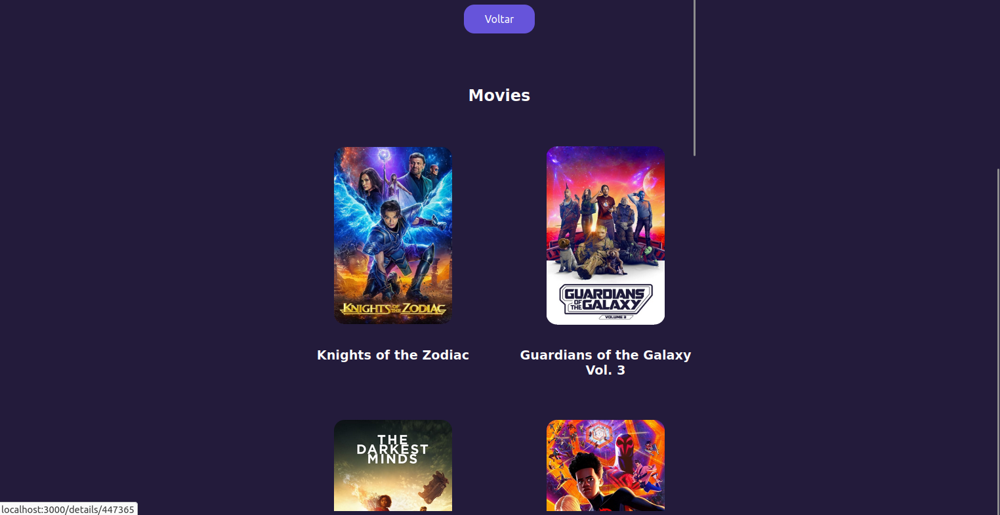
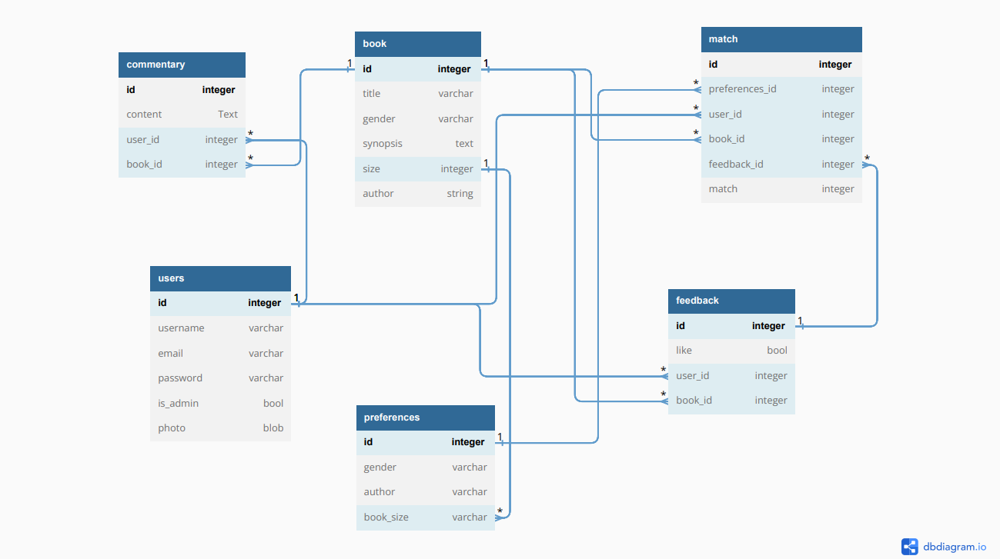
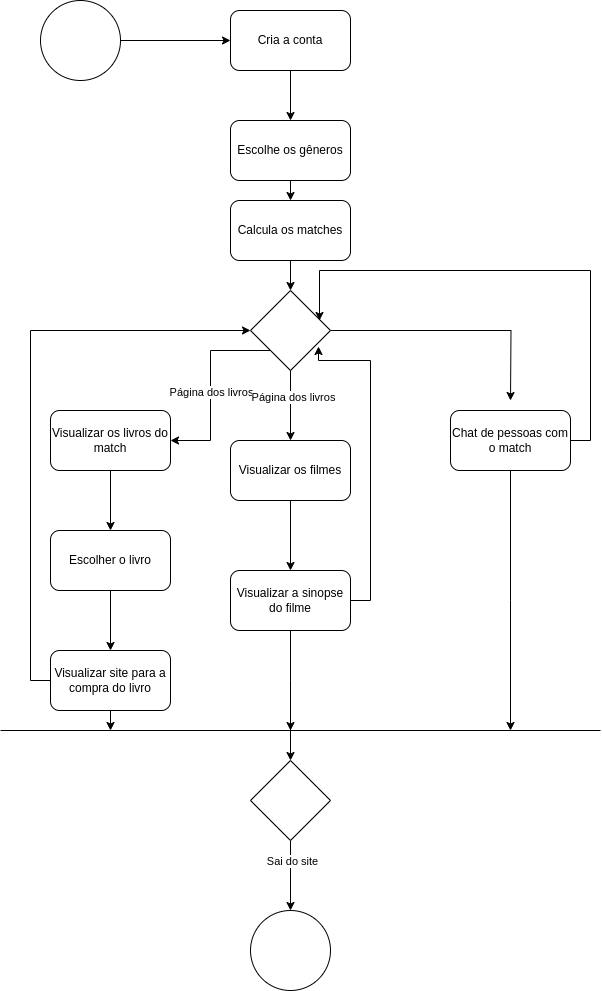
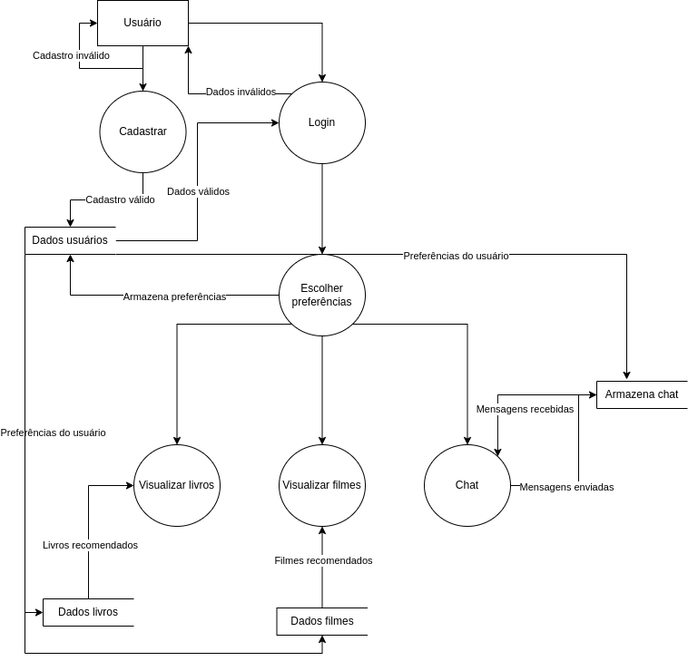

# Projeto MP 
[](https://github.com/LuisFlexa/projeto_MP/blob/main/LICENSE) 

# Sobre o projeto

BookWise é uma aplicação web construída através da utilização de local storage e necessita apenas de um servidor local. Foi elaborada para o Projeto final da matéria Métodos de Programação da Universidade de Brasília - UnB. 

A aplicação consiste em um site de preferência de livros e filmes, onde o usuário irá escolher suas preferências e com base nelas será aplicado um algoritmo de match para recomendar os filmes ou livros que possam satisfazer o gosto do usuário, além de um chat que funciona para usuários com gostos semelhantes, fazendo com que as pessoas conheçam outras com gostos parecidos.

## Layout web
### Página de login

### Página de preferências

### Página inicial

### Página do chat

### Página de recomendações 


## Diagrama de Models


## Diagrama das Atividades Match


## Diagrama do Fluxo de Dados


## Diagrama dos Casos de Uso


## Diagrama de sequência


# Tecnologias utilizadas
## Front end
- HTML / CSS / JS 
- ReactJS
- NodeJS 

## Implantação em produção
- Front end web: ReactJS 
- API de livros: The New York Times e GoogleBooks
- API de filmes: Imdb

# Como executar o projeto
Para executar o projeto, temos baixar o reporistório do projeto e temos que instalar o o node, npm e o pnpm. Para instalar os três, abra o terminal e digite:
```bash
# verificar atualizações de sistema
sudo apt update

#atualizar o sistema caso tenham atualizações
sudo apt upgrade

# instalar o nodejs
sudo apt install nodejs

# instalar o npm
sudo apt install npm

# instalar o curl
sudo apt-get install curl

# utilização do curl para a instalação do pnpm
curl -fsSL https://get.pnpm.io/install.sh | sh -

```

Após a instalação dos programas, vá para o diretório do projeto, abra o terminal e digite "npm start".

## Front end
Pré-requisitos: npm 9.5.1, node 18.16.0, pnpm 8.6.5, reactjs 18.2.0

```bash
# clonar repositório
git clone git@github.com:LuisFlexa/projeto_MP.git

# entrar na pasta do projeto front end
cd front-end

```

# Autor

Luis Antonio Benjamim Flexa

www.linkedin.com/in/luis-antonio-benjamim-flexa
